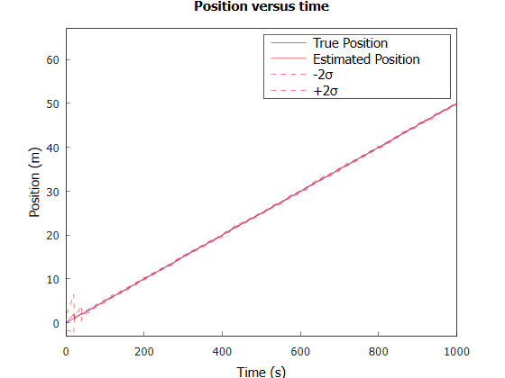
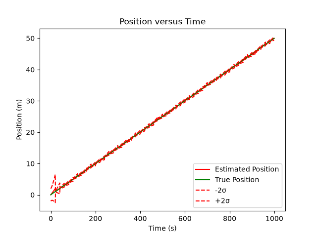
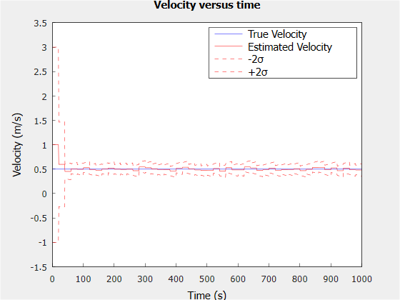
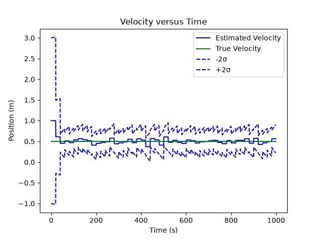

# Kalman Filter

> **Work in Progress**

This project implements a Kalman filter in C++ to estimate the position and velocity of a moving object from noisy measurements.

The filter uses **Eigen** for matrix operations and **Matplot++** for visualization. The current model tracks a two-state system consisting of position and velocity and performs prediction and measurement update steps.

## Features

- Position and velocity state estimation
- Prediction and measurement update steps
- Gaussian measurement noise
- Covariance and uncertainty tracking
- ±2σ uncertainty bounds
- Position and velocity visualization
- Python implementation included for comparison

## Position Results

### C++

### Python

## Velocity Results

### C++

### Python

## Dependencies

- C++17
- Eigen
- Matplot++D

## Future Work

- Integrate the Kalman filter with physical hardware
- Process real-time sensor measurements
- Run the filter on embedded hardware such as a Raspberry Pi
- Compare C++ and Python implementations using real sensor data
- Measure execution time and communication latency
- Expand the model to additional states and sensors
- Improve visualization and filter tuning

## Status

This project is currently in progress. The current implementation focuses on simulated position and velocity measurements. Future development will transition the filter toward real-time hardware integration and sensor-based measurements.